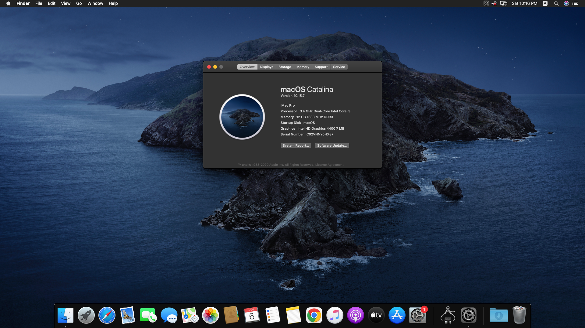

# Intel Hackintosh ( Haswell )
A Hackintosh is a computer that runs Apple's Macintosh operating system macOS on Intel based computer hardware that is not authorized for the purpose by Apple. In this hackintosh build i use OpenCore to multiboot Windows(11) and MacOS(Catalina) Olarila Vanila Images.

## Disclaimer
Please Use My Hackintosh EFI at your own risk. I take no responsiblity if your rig explodes. Create unique SMBios values for your rig. Don't use ones shown in the my efi config.plist!!!

## My iMac Pro (Hackintosh) About Screenshot

## Specification

| Component        | Model                                              |
| ---------------- | ---------------------------------------------------|
| CPU              | Intel i3 - 4th Gen 3.4 Ghz                           |
| MotherBoard      | AFOX H81M-D Plus                                   |
| OS Disk          | Kingman 128 GB SATA SSD                           |
| RAM              | 8gb + 8gb Adata DDR3 16GB Ram                      |
| GPU              | Intel iGPU HD 4400                                 |
| PS   	           | QORI 450W    		                                  |

## Installation Steps

* Download EFI Folder + macOS Catalina Olarila Image + Etcher + Mini Parition Tool + Explorer-Plus-Plus.
* Burn macOS raw Image To USB Drive (32GB) with Etcher
* Mount USB Driver EFI Folder Using Free Parition Wizard Tool
* Replace EFI Folder with My EFI into EFI partition.
* Restart PC & Boot From UEFI USB Drive (USE USB 2.0 PORT)
* Using Disk Utility Erase The Disk (APFS)
* Close Disk Utility & Install macOS Ventura.
* After Install Mount Disk EFI & USB Driver EFI with MountEFI and Replace the Disk EFI Folder with The USB Drive EFI Folder. (Do Not Miss This Step Other Wise Your Hackintosh Will Not Boot Without USB Drive)

## Credits and links

* [OpenCore install guide](https://dortania.github.io/OpenCore-Install-Guide)
* [Oralira Vanilla macOS Ventura ](https://www.olarila.com/topic/6278-olarila-vanilla-images-macos-installer/)
* [Ether Flashing Tool](https://etcher.balena.io)
* [Free Mini Partiton Tool](https://www.partitionwizard.com/free-partition-manager.html)
* [Explorer++](https://explorerplusplus.com/download)

## Thanks!!!
